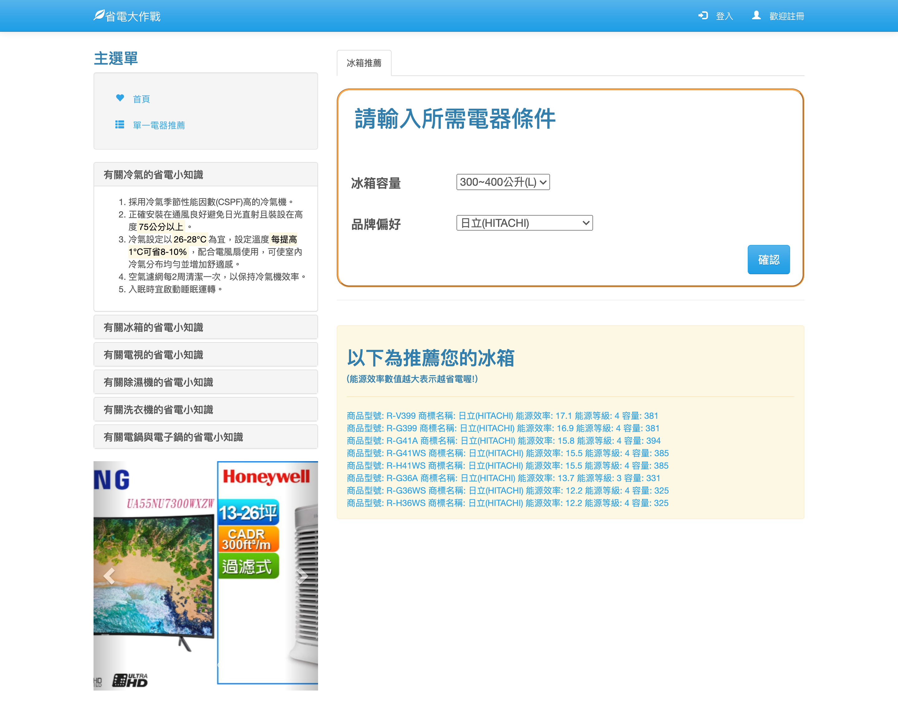

# Dev-env-dockerfile

#### 描述
電費計算與電器推薦平台，Docker開發環境檔案(dockerfile,docker-compose)和程式碼。
* [建立docker環境-(2020 xampp改docker)](#1)
* [系統功能簡述-(2018完成)](#2)

#### 檔案目錄結構
```
  .
  ├── code   // 放程式碼資料夾
  ├── nginx  // nginx設定檔、建立nginx image dockerfile
  ├── php-fpm  // php-fpm image dockerfile base on official php image
  └── docker-compose.yaml  // 用image建立container們，包含 nginx、php、phpmyadmin、db(mysql)
```

<h4 id="1">建立docker環境</h4>

* 建立自訂 nginx、php image
```shell
# nginx 資料夾底下，建立 nginx image
$ docker build -t my_nginx:v1

# php-fpm 資料夾底下，建立 php image
$ docker build -t my_php:v1
```

* 建立環境 container

```shell
# 根目錄下，用compose檔建立container們(nginx、php-fpm、phpmyadmin、db)
$ docker-compose up
```
* docker-compose.yaml 部分備註
```yaml
  # db使用mysqle官方image，另外使用phpmyamin官方image檔建立db操作介面，其他設定參考官方
  db:
    image: mysql
  phpmyadmin:
    image: phpmyadmin


  # nginx、php-fpm要mount到code資料夾
  nginx:
    volumes:
      - ./code:/var/www/my-ele-project/html
  php-fpm:
    volumes:
      - ./code:/var/www/my-ele-project/html


  # 新增container network: mynet，讓container可以在內部互相溝通 
  networks:
    mynet:
```

<h4 id="2">系統功能簡述-(2018完成)</h4>

* 首頁
  
  
* 未登入功能-單一電器推薦(依照喜好品牌、容量等)
  
  
* 登入功能-紀錄每月用電量(表單)
  
  
* 圖表化-使用者用電量
  
  
  


